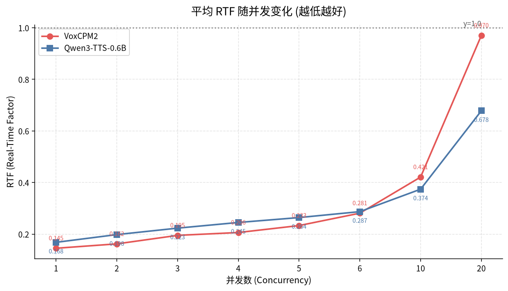
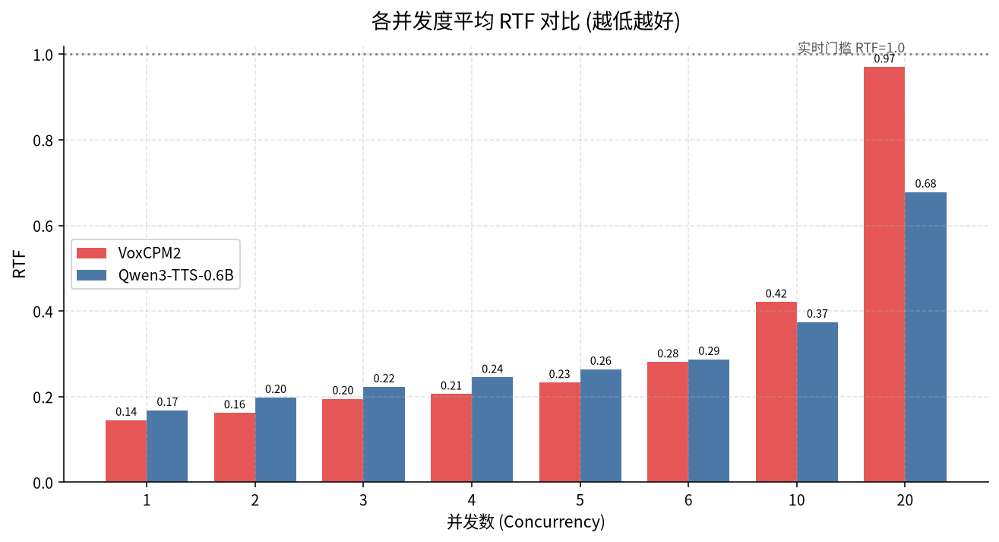
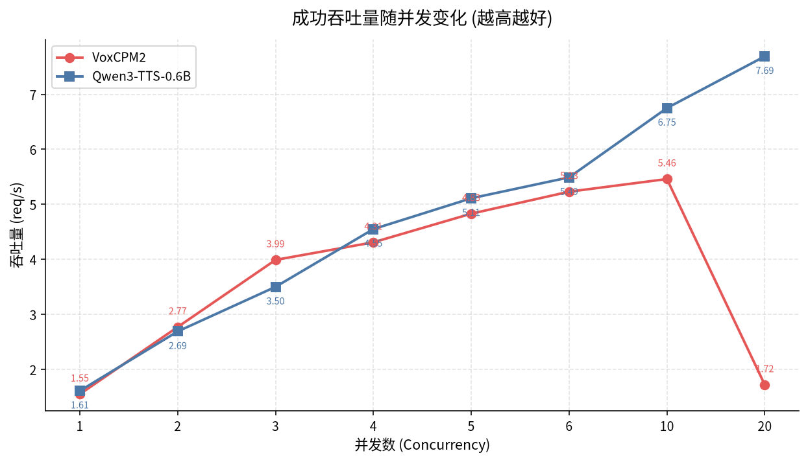
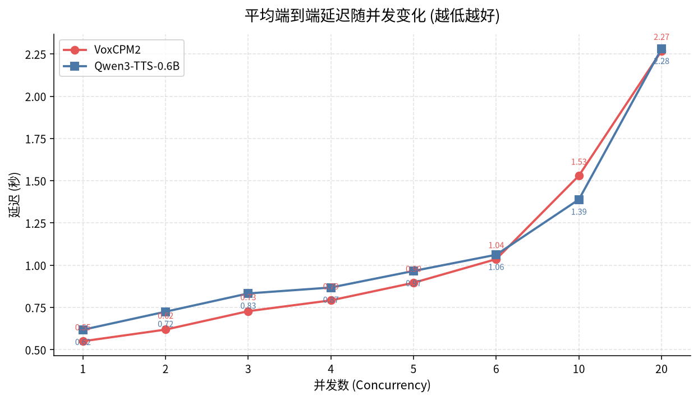
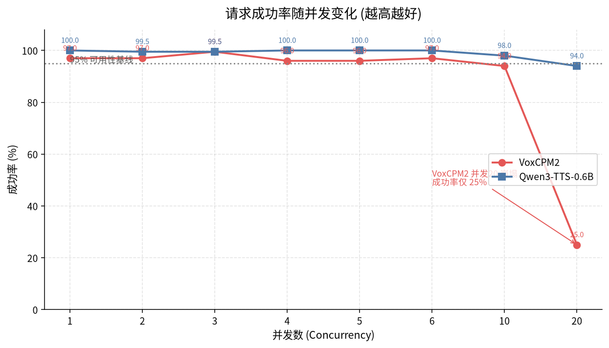
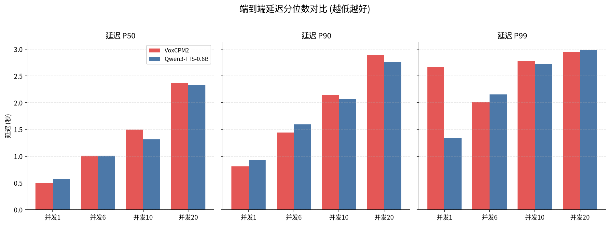
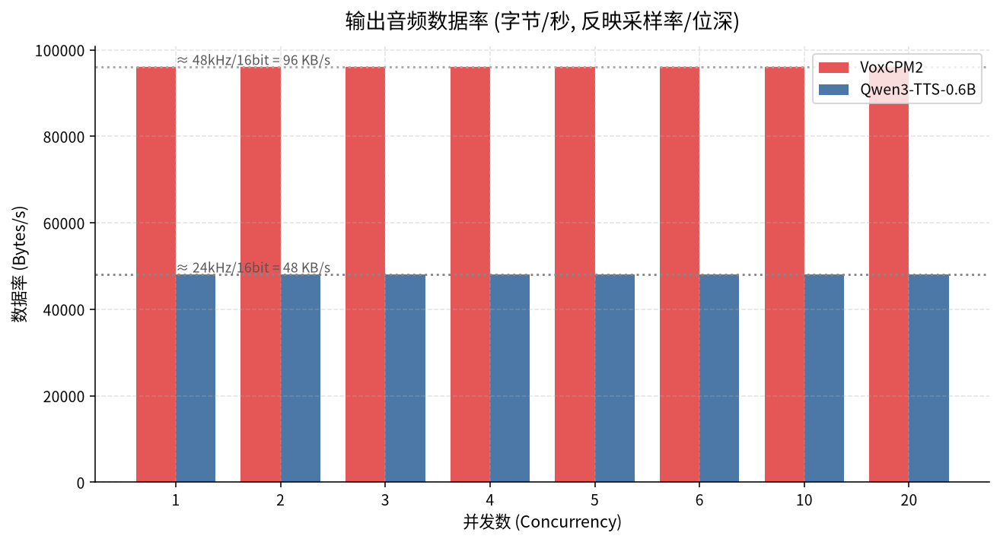

# Qwen3-TTS vs VoxCPM2 压测性能对比报告

> 测试时间: 2026-07-02
> 相关参考: [VoxCPM2 早期压测对比](https://github.com/Dan250124/vllm-omni/blob/feat/qwen3tts_vs_voxcpm2_bench/examples/online_serving/qwen3_tts/tts_bench_comparison.md) (当时 VoxCPM2 并发性能较差)
> 测试平台: 1× NVIDIA L20 (48GB) | AMD EPYC 9K84 | CUDA 12.4
> 软件版本: vLLM-Omni 0.23.0rc1 | vLLM 0.23.1.dev0 | PyTorch 2.11.0+cu128
> 部署方式: vLLM-Omni `--omni` 单卡部署, 每组 200 请求, 并发度 1→20

---

## 0. TL;DR 速览

| 维度 | 胜出方 | 一句话结论 |
|---|:---:|---|
| **低并发 (1–6) 单请求效率** | 🟢 VoxCPM2 | RTF 更低、延迟更短, 单卡 "又快又省" |
| **高并发 (≥10) 吞吐** | 🔵 Qwen3-TTS | 成功吞吐更高, 并发 20 时达 VoxCPM2 的 **4.5×** |
| **极限并发 (20) 稳定性** | 🔵 Qwen3-TTS | Qwen3-TTS 成功率 94%, VoxCPM2 **崩塌至 25%** |
| **输出音频保真度** | 🟢 VoxCPM2 | 48 kHz / 16 bit PCM, 数据率为 Qwen3-TTS 的 **2×** (24 kHz) |
| **综合选型** | 视场景 | 对话/低并发选 VoxCPM2; 高并发服务选 Qwen3-TTS |

> ⚠️ **公平性提示**: 两个模型的**输出音频采样率不同** (VoxCPM2 ≈ 48 kHz, Qwen3-TTS ≈ 24 kHz, 详见 [§3](#3-输出音频保真度差异48-khz-vs-24-khz))。因此 VoxCPM2 每秒音频需合成 2 倍的样本数, 直接对比 RTF 时需将此因素纳入考量——VoxCPM2 在低并发下更低的 RTF 实际上"含金量"更高, 而它在高并发下的崩塌也部分源于更重的声码器负载。

---

## 1. 测试环境概览

### 1.1 硬件

| 组件 | 规格 |
|---|---|
| GPU | 1× NVIDIA **L20** (48 GB) |
| GPU 驱动 | 535.154.05 |
| CUDA Runtime | 12.4.131 (PyTorch 编译于 CUDA 12.8) |
| CPU | AMD EPYC 9K84 96-Core (64 线程可见, 1 路径) |
| 内存/NUMA | 单 NUMA node |
| OS | Ubuntu 22.04.4 LTS (x86_64) |

### 1.2 软件栈

| 组件 | 版本 |
|---|---|
| vLLM-Omni | 0.23.0rc1 |
| vLLM | 0.23.1.dev0 (git 0fc695fc6, 2026-06-16) |
| PyTorch | 2.11.0+cu128 |
| Python | 3.12.13 |
| flashinfer | 0.6.12 |
| transformers | 5.9.0 |
| numpy | 2.3.5 |

### 1.3 被测模型与部署命令

| 模型 | 来源 | 部署命令 |
|---|---|---|
| **VoxCPM2** | `OpenBMB/VoxCPM2` | `vllm serve OpenBMB/VoxCPM2 --deploy-config vllm_omni/deploy/voxcpm2.yaml --omni --host 0.0.0.0 --port 8000` |
| **Qwen3-TTS** | `Qwen/Qwen3-TTS-12Hz-0.6B-Base` | `vllm serve Qwen/Qwen3-TTS-12Hz-0.6B-Base --deploy-config vllm_omni/deploy/qwen3_tts.0.6b.yaml --omni --host 0.0.0.0 --port 8000` |

两组模型均在**同一台单卡 L20** 上、以相同的 vLLM-Omni `--omni` 模式部署; 压测脚本 `bench.py`, 每个并发档位固定发送 **200 个请求**, 并发度依次取 1 / 2 / 3 / 4 / 5 / 6 / 10 / 20。输入文本产生的音频平均时长约 **3.5–3.9 秒**。

---

## 2. 核心指标对比

### 2.1 RTF (Real-Time Factor) — 越低越好

RTF = 合成耗时 / 音频时长。RTF < 1.0 表示合成速度快于实时播放; 越接近 0 越高效。

| 并发 | VoxCPM2 | Qwen3-TTS | 更优 | 差异 |
|:---:|:---:|:---:|:---:|---|
| 1 | **0.145** | 0.168 | VoxCPM2 | 低 13.7% |
| 2 | **0.162** | 0.198 | VoxCPM2 | 低 18.2% |
| 3 | **0.195** | 0.223 | VoxCPM2 | 低 12.6% |
| 4 | **0.206** | 0.245 | VoxCPM2 | 低 15.9% |
| 5 | **0.233** | 0.264 | VoxCPM2 | 低 11.7% |
| 6 | **0.281** | 0.287 | ≈ 持平 | 低 2.1% |
| 10 | 0.421 | **0.374** | Qwen3-TTS | 低 11.2% |
| 20 | 0.970 | **0.678** | Qwen3-TTS | 低 30.1% |



**各并发度平均 RTF 柱状对比:**



**观察**:
- **交叉点位于并发 6–10 之间**。并发 ≤ 6 时 VoxCPM2 的 RTF 始终更低; 并发 ≥ 10 时 Qwen3-TTS 反超。
- 并发 20 时 VoxCPM2 的 RTF 已逼近 **0.97** (几近实时门槛), 而 Qwen3-TTS 仍维持在 0.68。
- 考虑到 VoxCPM2 输出采样率是 Qwen3-TTS 的 2 倍 (§3), 其低并发下的 RTF 优势含金量更高。

---

### 2.2 吞吐量 (成功吞吐) — 越高越好

下表使用 **成功吞吐** (成功请求数 / 总耗时), 它同时反映速度与稳定性, 是服务化部署最该关注的指标。

| 并发 | VoxCPM2 | Qwen3-TTS | 更优 |
|:---:|:---:|:---:|:---:|
| 1 | 1.55 | **1.61** | Qwen3-TTS |
| 2 | **2.77** | 2.69 | VoxCPM2 |
| 3 | **3.99** | 3.50 | VoxCPM2 |
| 4 | 4.31 | **4.55** | Qwen3-TTS |
| 5 | 4.83 | **5.11** | Qwen3-TTS |
| 6 | 5.23 | **5.49** | Qwen3-TTS |
| 10 | 5.46 | **6.75** | Qwen3-TTS (+23.6%) |
| 20 | 1.72 | **7.69** | Qwen3-TTS (**4.5×**) |



**观察**:
- 并发 2–3 时 VoxCPM2 吞吐略高; 从并发 4 起局面反转, Qwen3-TTS 持续领先。
- **并发 20 是分水岭**: VoxCPM2 因成功率崩塌 (见 §2.4), 成功吞吐从 5.46 (并发10) **断崖下跌到 1.72**; Qwen3-TTS 则继续爬升到 7.69, 达到 VoxCPM2 的 **4.5 倍**。

---

### 2.3 平均端到端延迟 — 越低越好

| 并发 | VoxCPM2 | Qwen3-TTS | 更优 |
|:---:|:---:|:---:|:---:|
| 1 | **0.550** | 0.618 | VoxCPM2 |
| 2 | **0.619** | 0.725 | VoxCPM2 |
| 3 | **0.728** | 0.833 | VoxCPM2 |
| 4 | **0.792** | 0.868 | VoxCPM2 |
| 5 | **0.896** | 0.966 | VoxCPM2 |
| 6 | **1.036** | 1.062 | VoxCPM2 |
| 10 | 1.530 | **1.389** | Qwen3-TTS |
| 20 | **2.269** | 2.281 | ≈ 持平 |



**观察**:
- 并发 ≤ 6 时 VoxCPM2 平均延迟始终更低 (低 7%–15%)。
- 并发 10 时 Qwen3-TTS 反超 (1.389s vs 1.530s)。
- 并发 20 两者平均延迟几乎相同 (~2.3s)——但此时 VoxCPM2 **仅 25% 的请求成功**, 能在 ~2.3s 内返回的是"幸存者", 因此该数字不具可比性。

---

### 2.4 请求成功率 — 越高越好

| 并发 | VoxCPM2 | Qwen3-TTS |
|:---:|:---:|:---:|
| 1 | 97.0% | **100%** |
| 2 | 97.0% | **99.5%** |
| 3 | **99.5%** | 99.5% |
| 4 | 96.0% | **100%** |
| 5 | 96.0% | **100%** |
| 6 | 97.0% | **100%** |
| 10 | 94.0% | **98.0%** |
| 20 | 🔴 **25.0%** | 🟢 **94.0%** |



**观察**:
- 并发 1–10 区间, 两者成功率都在 94%–100%, Qwen3-TTS 整体更稳 (多数档位 100%)。
- **并发 20 时 VoxCPM2 发生雪崩**: 成功率从 94% (并发10) 直坠到 **25%** (200 个请求仅 50 个成功, 150 个失败); 同档位 Qwen3-TTS 仍保持 94%。
- 这是本次压测**最显著的差异**: VoxCPM2 在单卡 L20 上的稳定承载上限约为 **并发 10**, 而 Qwen3-TTS 可稳定承载到 **并发 20**。

---

### 2.5 延迟分位数 (P50 / P90 / P99)

```
P99 延迟对比 (并发 = 10, 越低越好):
Qwen3-TTS  ████████████████████████████░░░░░░░░░░  2.73s   ← 更优
VoxCPM2    ███████████████████████████████░░░░░░░░  2.78s
```

| 延迟分位 | 并发 | VoxCPM2 | Qwen3-TTS |
|:---:|:---:|:---:|:---:|
| **P50** | 1 | 0.499s | 0.579s |
| **P50** | 6 | 1.007s | 1.013s |
| **P50** | 10 | 1.495s | 1.312s |
| **P50** | 20 | 2.366s | 2.322s |
| **P90** | 10 | 2.141s | 2.066s |
| **P99** | 10 | 2.779s | 2.729s |
| **P99** | 20 | 2.944s | 2.980s |



> 📌 **异常注记**: VoxCPM2 在 **并发 1** 时 P99 高达 **2.663s** (P95 仅 0.944s, 最大 2.695s), 存在明显的长尾离群点; 自并发 2 起 P99 回落到 1.893s 并趋于正常。Qwen3-TTS 各档位 P99/P95 走势平滑, 长尾控制更好。

---

## 3. 输出音频保真度差异 (48 kHz vs 24 kHz)

由原始数据中的「音频字节 / 音频总秒数」可反推两个模型的**输出 PCM 数据率**:

| 模型 | 数据率 (Bytes/s) | 推测格式 | 相对 |
|---|:---:|---|:---:|
| **VoxCPM2** | ≈ **96 020** | 48 kHz / 16-bit / mono | 2.0× |
| **Qwen3-TTS** | ≈ **48 010** | 24 kHz / 16-bit / mono | 1.0× |



各组测试该比值高度稳定 (波动 < 0.1%), 可确认 **VoxCPM2 的输出采样率为 Qwen3-TTS 的 2 倍**。

**这对性能对比意味着什么**:
- RTF = 合成耗时 / 音频秒数。在相同"音频秒数"下, VoxCPM2 的声码器需要生成 **2 倍的样本数**, 即单请求算力开销更重。
- 因此 VoxCPM2 在低并发 (1–6) 下仍能取得更低 RTF, 说明其**单请求生成效率优秀**;
- 但更重的声码器也使其在单卡上**更早触顶**——这是并发 20 时它崩盘、而 Qwen3-TTS 仍稳健的关键原因之一。
- 选用时需权衡: VoxCPM2 输出音质 (采样率) 更高, 适合对听感要求高的场景; Qwen3-TTS 以一半的数据率换取了更强的并发承载力。

---

## 4. 关键发现与分析

### 4.1 低并发: VoxCPM2 更快、更省

| 指标 (并发 1–6) | 更优方 | 典型差距 |
|---|:---:|---|
| RTF | VoxCPM2 | 低 12%–18% |
| 平均延迟 | VoxCPM2 | 低 7%–15% |
| 成功率 | Qwen3-TTS | 多数 100% vs VoxCPM2 96%–99% |

> **解读**: 在单用户 / 少并发场景 (如本地助手、实时对话), VoxCPM2 响应更快, 且输出 48 kHz 高保真音频, 体验更佳。唯一代价是成功率偶有 3%–4% 的失败 (低并发下可重试覆盖)。

### 4.2 高并发: Qwen3-TTS 更稳、更猛

| 指标 (并发 10–20) | 更优方 | 典型差距 |
|---|:---:|---|
| 成功吞吐 (并发10) | Qwen3-TTS | +23.6% |
| 成功吞吐 (并发20) | Qwen3-TTS | **+347% (4.5×)** |
| 成功率 (并发20) | Qwen3-TTS | 94% vs 25% |
| RTF (并发20) | Qwen3-TTS | 低 30% |

> **解读**: 服务化 / 多租户场景下, 稳定性 (成功率) 与成功吞吐是核心。Qwen3-TTS 在并发 20 仍能保持 94% 成功率与 7.69 req/s 吞吐, 明显更适合做高并发 TTS 后端。

### 4.3 单卡 L20 的承载上限

```
单卡稳定承载上限 (成功率 ≥ 90% 基线):
VoxCPM2     [1 ═══════════════ 10]   并发 10 即接近极限, 并发 20 崩塌
Qwen3-TTS   [1 ═══════════════════════ 20]   并发 20 仍稳健 (94%)
```

VoxCPM2 的崩塌点位于并发 10→20 之间; Qwen3-TTS 在本次测试的上限 (并发 20) 仍未出现崩塌迹象, 实际极限可能更高。

### 4.4 综合效率 (吞吐 ÷ 音频数据量)

考虑到 VoxCPM2 每个成功请求产出 2× 字节数据, 以**「成功吞吐 × 单秒数据率」= 每秒稳定产出的音频字节**衡量综合产出:

| 并发 20 | 成功吞吐 | × 数据率 | = 字节/秒 产出 |
|---|:---:|:---:|:---:|
| VoxCPM2 | 1.72 req/s | 96 KB/s | ≈ 165 KB/s |
| Qwen3-TTS | 7.69 req/s | 48 KB/s | ≈ **369 KB/s** |

即便计入 VoxCPM2 单请求 2 倍的数据量, **Qwen3-TTS 在并发 20 下的综合产出仍是 VoxCPM2 的 ~2.2 倍**。

---

## 5. 选型建议

| 场景 | 推荐 | 理由 |
|---|:---:|---|
| **本地/边缘, 低并发 (≤6)** | 🟢 VoxCPM2 | 延迟更低、RTF 更优、48 kHz 高保真输出 |
| **实时对话 (流式, 关注首包)** | 🟢 VoxCPM2 | 单请求效率高, 低并发延迟优势明显 |
| **服务化 API, 中高并发 (10–20)** | 🔵 Qwen3-TTS | 成功率与吞吐显著占优, 单卡承载上限更高 |
| **多租户 / 高负载后端** | 🔵 Qwen3-TTS | 并发 20 仍 94% 成功率, 吞吐 7.69 req/s |
| **对音质有极致要求** | 🟢 VoxCPM2 | 48 kHz 输出, 但需接受较低的单卡并发上限 |
| **显存/算力受限的单卡** | 🔵 Qwen3-TTS | 24 kHz 输出负载更轻, 同卡可承载更多并发 |

**容量规划小结** (单卡 L20):
- 选 **VoxCPM2**: 建议把生产并发控制在 **≤ 10**; 超过需扩容 (加卡或改高并发部署配置)。
- 选 **Qwen3-TTS**: 单卡可放心承载到 **并发 20**, 余量充足。

---

## 6. 复现说明

本报告所有图表由项目目录下的 `gen_charts.py` 生成, 使用 **uv 隔离环境**, 不污染系统 Python:

```bash
cd qwen3-tts-vs-voxcpm2

# 1. 创建隔离虚拟环境
uv venv --python 3.12 .venv

# 2. 安装依赖到 .venv (matplotlib + numpy)
uv pip install --python .venv/bin/python matplotlib numpy

# 3. 生成全部图表到 charts/
.venv/bin/python gen_charts.py
```

- 原始数据: `benchmark.txt` (压测输出) / `env.txt` (环境信息)
- 图表输出: `charts/*.png` (7 张)
- 中文字体: `assets/NotoSansSC-Regular.otf` (OFL 协议, 脚本会自动加载; 缺失时回退查找系统/Windows 字体路径)

---

## 7. 总结

1. **没有绝对的赢家, 只有场景化的取舍。** VoxCPM2 在低并发下更快、音质更高; Qwen3-TTS 在高并发下更稳、吞吐更高。

2. **采样率差异是隐藏的关键变量。** VoxCPM2 输出 48 kHz PCM (2× 于 Qwen3-TTS 的 24 kHz), 这既解释了它低并发下的高效含金量, 也解释了它高并发下更早触顶崩盘。

3. **VoxCPM2 的并发 20 雪崩 (25% 成功率) 是本次测试最重要的发现。** 单卡 L20 部署下, 其稳定承载上限约为并发 10; 若服务化使用, 务必做好过载保护或改用高并发部署配置。

4. **Qwen3-TTS 展现出更强的高负载韧性。** 并发 20 仍保持 94% 成功率与 7.69 req/s 成功吞吐, 综合数据产出为 VoxCPM2 的 ~2.2 倍, 是高并发 TTS 后端的更稳妥选择。

5. **选型一句话**: 对话/低并发/重音质 → **VoxCPM2**; 服务化/高并发/重稳定 → **Qwen3-TTS**。
