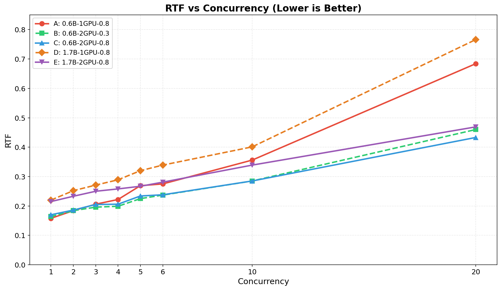
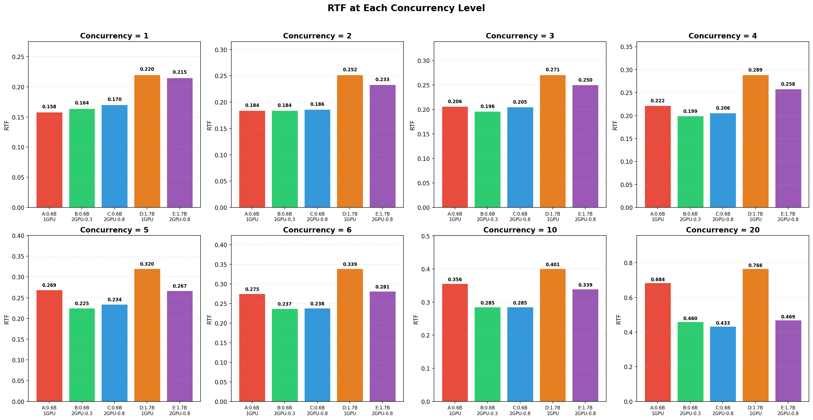
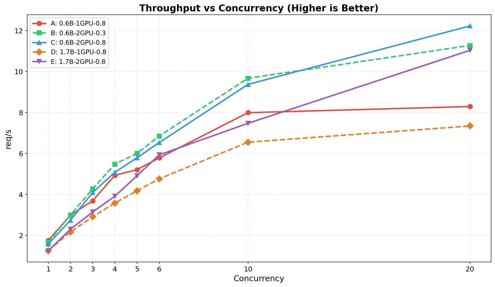
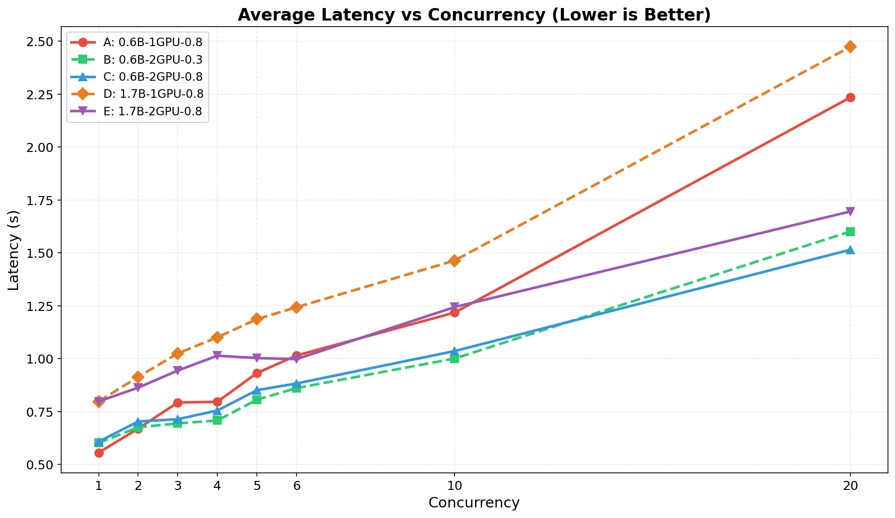
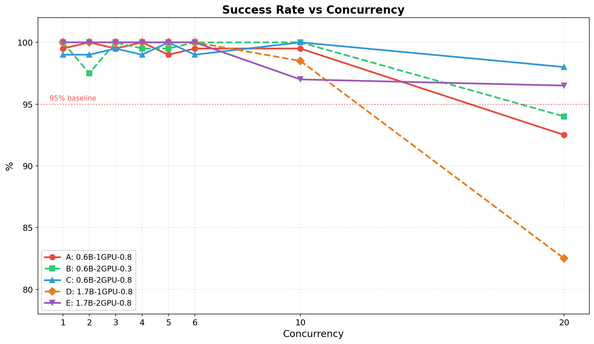

# Qwen3-TTS vllm-omni 单卡与双卡推理压测报告

> 测试时间: 2026-06-01
> 测试平台: 2x NVIDIA L20 (48GB) | AMD EPYC 9K84 | CUDA 12.4
> 软件版本: vLLM-Omni 0.20.1 | vLLM 0.21.1 | PyTorch 2.11.0

---

## 0. 双卡高并发部署背景

Qwen3-TTS 在 vLLM-Omni 中的推理流程分为两个阶段:

- **Stage 0 (Talker)**: 文本语言模型, 负责将输入文本预测为离散音频 token 序列。
- **Stage 1 (Code2Wav)**: 声码器 (Vocoder), 负责将音频 token 解码为最终波形。

在单卡部署下, 两个阶段共享同一张 GPU, 高并发时互相争抢算力, 导致延迟飙升、成功率下降。

vLLM-Omni 提供了 [qwen3_tts_high_concurrency.yaml](https://github.com/vllm-project/vllm-omni/blob/main/vllm_omni/deploy/qwen3_tts_high_concurrency.yaml) 高并发部署配置, 核心思路是**将两个阶段分离到不同 GPU 上**:

```
GPU 0 → Stage 0 (Talker)       max_num_seqs=64,  gpu_memory_utilization=0.3
GPU 1 → Stage 1 (Code2Wav)     max_num_seqs=10,  gpu_memory_utilization=0.3
         ↕ 共享内存 (SharedMemoryConnector)
```

**工作原理**:

1. **阶段隔离**: Stage 0 独占 GPU 0 进行文本到 token 的批量推理, Stage 1 独占 GPU 1 进行 token 到波形的解码, 两者通过共享内存 (`SharedMemoryConnector`) 传递中间结果, 避免跨卡序列化开销。
2. **异步调度** (`async_scheduling: true`): Stage 0 产出的 token 流式传递给 Stage 1, 无需等待整个序列生成完毕, 降低端到端首包延迟。
3. **CUDA Graph 加速**: Stage 0 预捕获前缀 CUDA Graph (`prefix_graph_buckets: [64]`), Stage 1 按固定帧数桶捕获解码 Graph (`decode_cudagraph_capture_sizes: [25, 73, 97, 169, 325]`), 减少内核启动开销。
4. **流式音频输出** (`codec_streaming: true`): 音频以小块 (chunk) 方式流式返回, 客户端可边生成边播放, 进一步降低体感延迟。

本次压测中的双卡配置 (B/C/E) 即基于此高并发配置方案, 分别调整 `gpu_memory_utilization` 和模型大小进行对比。

---

## 1. 测试配置概览

| 编号 | 配置名称 | 模型 | GPU数量 | gpu_memory_utilization | 显存占用(GPU0/GPU1) |
|:---:|---|---|:---:|:---:|---|
| A | **0.6B-1GPU** | Qwen3-TTS-12Hz-0.6B-Base | 1 | 0.3 | ~22GB / - |
| B | **0.6B-2GPU-0.3** | Qwen3-TTS-12Hz-0.6B-Base | 2 | 0.3 | ~14GB / ~6GB |
| C | **0.6B-2GPU-0.8** | Qwen3-TTS-12Hz-0.6B-Base | 2 | 0.8 | ~37GB / ~6GB |
| D | **1.7B-1GPU** | Qwen3-TTS-12Hz-1.7B-Base | 1 | 0.8 | ~22GB / - |
| E | **1.7B-2GPU-0.8** | Qwen3-TTS-12Hz-1.7B-Base | 2 | 0.8 | ~37GB / ~6GB |

> 每组测试发送 200 个请求, 并发度从 1 递增到 20。音频平均时长约 3.5-3.8s。

---

## 2. 核心指标对比

### 2.1 RTF (Real-Time Factor) 对比 — 越低越好

RTF = 合成耗时 / 音频时长, RTF < 1.0 表示合成速度快于实时播放。

| 并发 | A: 0.6B-1GPU | B: 0.6B-2GPU-0.3 | C: 0.6B-2GPU-0.8 | D: 1.7B-1GPU | E: 1.7B-2GPU-0.8 |
|:---:|:---:|:---:|:---:|:---:|:---:|
| 1 | **0.158** | 0.164 | 0.170 | 0.220 | 0.215 |
| 2 | **0.184** | 0.184 | 0.186 | 0.252 | 0.233 |
| 3 | 0.206 | **0.196** | 0.205 | 0.271 | 0.250 |
| 4 | 0.222 | **0.199** | 0.206 | 0.289 | 0.258 |
| 5 | 0.269 | 0.225 | **0.234** | 0.320 | 0.267 |
| 6 | 0.275 | **0.237** | 0.238 | 0.339 | 0.281 |
| 10 | 0.356 | **0.285** | 0.285 | 0.401 | 0.339 |
| 20 | 0.684 | 0.460 | **0.433** | 0.766 | 0.469 |



**各并发度 RTF 柱状图对比:**



---

### 2.2 吞吐量 (Throughput) 对比 — 越高越好

| 并发 | A: 0.6B-1GPU | B: 0.6B-2GPU-0.3 | C: 0.6B-2GPU-0.8 | D: 1.7B-1GPU | E: 1.7B-2GPU-0.8 |
|:---:|:---:|:---:|:---:|:---:|:---:|
| 1 | 1.76 | 1.66 | 1.58 | 1.25 | 1.25 |
| 2 | 2.98 | 3.00 | 2.74 | 2.17 | 2.30 |
| 3 | 3.69 | **4.27** | 4.09 | 2.91 | 3.14 |
| 4 | 4.93 | **5.48** | 5.08 | 3.58 | 3.91 |
| 5 | 5.21 | 6.00 | 5.79 | 4.18 | 4.91 |
| 6 | 5.78 | 6.85 | 6.53 | 4.76 | 5.93 |
| 10 | 7.99 | **9.67** | 9.37 | 6.55 | 7.47 |
| 20 | 8.29 | 11.27 | **12.22** | 7.34 | 11.03 |



---

### 2.3 平均延迟 (Latency) 对比 — 越低越好

| 并发 | A: 0.6B-1GPU | B: 0.6B-2GPU-0.3 | C: 0.6B-2GPU-0.8 | D: 1.7B-1GPU | E: 1.7B-2GPU-0.8 |
|:---:|:---:|:---:|:---:|:---:|:---:|
| 1 | **0.556** | 0.602 | 0.608 | 0.798 | 0.798 |
| 2 | **0.669** | 0.676 | 0.703 | 0.914 | 0.863 |
| 3 | 0.793 | **0.694** | 0.714 | 1.025 | 0.944 |
| 4 | 0.796 | **0.708** | 0.755 | 1.101 | 1.014 |
| 5 | 0.932 | **0.806** | 0.851 | 1.187 | 1.003 |
| 6 | 1.015 | **0.861** | 0.883 | 1.243 | 0.998 |
| 10 | 1.218 | **1.001** | 1.036 | 1.464 | 1.244 |
| 20 | 2.235 | 1.601 | **1.515** | 2.474 | 1.696 |



---

### 2.4 成功率对比

| 并发 | A: 0.6B-1GPU | B: 0.6B-2GPU-0.3 | C: 0.6B-2GPU-0.8 | D: 1.7B-1GPU | E: 1.7B-2GPU-0.8 |
|:---:|:---:|:---:|:---:|:---:|:---:|
| 1 | 99.5% | 100% | 99.0% | 100% | 100% |
| 2 | 100% | 97.5% | 99.0% | 100% | 100% |
| 3 | 99.5% | 100% | 99.5% | 100% | 100% |
| 4 | 100% | 99.5% | 99.0% | 100% | 100% |
| 5 | 99.0% | 99.5% | 100% | 100% | 100% |
| 6 | 99.5% | 100% | 99.0% | 100% | 100% |
| 10 | 99.5% | 100% | 100% | 98.5% | 97.0% |
| 20 | **92.5%** | 94.0% | 98.0% | **82.5%** | 96.5% |



---

## 3. GPU 资源利用

### 3.1 显存占用

| 配置 | GPU0 显存 | GPU1 显存 | GPU0 利用率 (并发=1) | GPU0 利用率 (并发=6) | GPU0 利用率 (并发=10) |
|---|:---:|:---:|:---:|:---:|:---:|
| A: 0.6B-1GPU-0.8 | ~22GB | - | - | - | - |
| B: 0.6B-2GPU-0.3 | ~14GB | ~6GB | 70% | 71% | 71% |
| C: 0.6B-2GPU-0.8 | ~37GB | ~6GB | 70% | 78% | 74% |
| D: 1.7B-1GPU-0.8 | ~22GB | - | 77% | - | 77% |
| E: 1.7B-2GPU-0.8 | ~37GB | ~6GB | 78% | 79% | 78% |

```
显存占用对比 (GPU0):
A 0.6B-1GPU     ██████████████████████░░░░░░░░░░░░░░░░░░░░░  22GB / 48GB
B 0.6B-2GPU-0.3 ██████████████░░░░░░░░░░░░░░░░░░░░░░░░░░░░  14GB / 48GB
C 0.6B-2GPU-0.8 ██████████████████████████████████████░░░░░  37GB / 48GB
D 1.7B-1GPU     ██████████████████████░░░░░░░░░░░░░░░░░░░░░  22GB / 48GB
E 1.7B-2GPU-0.8 ██████████████████████████████████████░░░░░  37GB / 48GB
```

### 3.2 GPU 利用率随并发变化

| 配置 | 并发1 | 并发4 | 并发6 | 并发10 | 并发20 |
|---|:---:|:---:|:---:|:---:|:---:|
| B: 0.6B-2GPU-0.3 | 70% | 77% | 71% | 71% | 70% |
| C: 0.6B-2GPU-0.8 | 70% | 77% | 78% | 74% | 78% |
| E: 1.7B-2GPU-0.8 | 78% | 77% | 79% | 78% | 78% |

> GPU0 利用率始终在 70%-79% 之间, 并未随并发显著上升, 说明瓶颈可能在 CPU 侧或 IO 侧, 而非纯 GPU 算力。

---

## 4. 延迟分布 (P50 / P90 / P99)

### 4.1 0.6B 模型 P99 延迟

| 并发 | A: 1GPU | B: 2GPU-0.3 | C: 2GPU-0.8 |
|:---:|:---:|:---:|:---:|
| 1 | 1.290s | 1.230s | 1.163s |
| 4 | 1.565s | 1.511s | 1.488s |
| 10 | 2.599s | 2.127s | 2.032s |
| 20 | 2.874s | 2.953s | 2.700s |

### 4.2 1.7B 模型 P99 延迟

| 并发 | D: 1GPU | E: 2GPU-0.8 |
|:---:|:---:|:---:|
| 1 | 1.620s | 1.582s |
| 4 | 2.314s | 2.144s |
| 10 | 2.847s | 2.725s |
| 20 | 3.001s | 2.875s |

```
P99 延迟对比 (并发=10):
C 0.6B-2GPU-0.8 ███████████████████████████████████████░░░  2.03s
B 0.6B-2GPU-0.3 █████████████████████████████████████████░  2.13s
A 0.6B-1GPU     ███████████████████████████████████████████████████░  2.60s
E 1.7B-2GPU-0.8 ██████████████████████████████████████████████████████░  2.73s
D 1.7B-1GPU     ███████████████████████████████████████████████████████████░  2.85s
```

---

## 5. 关键发现与分析

### 5.1 模型大小对比: 0.6B vs 1.7B

| 指标 | 0.6B 优势幅度 | 说明 |
|---|---|---|
| RTF (单并发) | **快 28-30%** | 0.6B RTF ~0.16 vs 1.7B RTF ~0.22 |
| RTF (并发10) | **快 15-20%** | 差距随并发缩小 |
| 吞吐量 (并发10) | **高 22-46%** | 0.6B 单卡 7.99 vs 1.7B 单卡 6.55 |
| 延迟 (并发10) | **低 15-20%** | 0.6B 更快的单请求处理 |
| 显存占用 | **基本相同** | 两者单卡均 ~22GB |

> **结论**: 0.6B 在所有并发度下均优于 1.7B, 且显存占用基本一致。在音质可接受的前提下, 0.6B 是更高效的选型。

### 5.2 单卡 vs 双卡对比

| 配置 | 并发=1 吞吐 | 并发=10 吞吐 | 并发=20 吞吐 | 并发=20 成功率 |
|---|:---:|:---:|:---:|:---:|
| 0.6B-1GPU | 1.76 | 7.99 | 8.29 | 92.5% |
| 0.6B-2GPU-0.3 | 1.66 | **9.67** | **11.27** | 94.0% |
| 0.6B-2GPU-0.8 | 1.58 | 9.37 | **12.22** | **98.0%** |
| 1.7B-1GPU | 1.25 | 6.55 | 7.34 | 82.5% |
| 1.7B-2GPU-0.8 | 1.25 | 7.47 | **11.03** | **96.5%** |

> **结论**: 双卡在高并发场景下优势明显:
> - **并发 <= 4**: 双卡无明显优势甚至略慢 (跨卡通信开销)
> - **并发 >= 10**: 双卡吞吐量提升 **20%-50%**
> - **并发 = 20**: 双卡成功率显著高于单卡 (98% vs 92.5%/82.5%)

### 5.3 gpu_memory_utilization 对比: 0.3 vs 0.8

| 指标 (0.6B 双卡) | 0.3 | 0.8 | 差异 |
|---|:---:|:---:|---|
| GPU0 显存占用 | 14GB | 37GB | 0.8 多占 23GB |
| 并发=1 RTF | 0.164 | 0.170 | 基本相同 |
| 并发=10 RTF | 0.285 | 0.285 | 完全相同 |
| 并发=10 吞吐 | 9.67 | 9.37 | 基本相同 |
| 并发=20 吞吐 | 11.27 | 12.22 | 0.8 高 8.4% |
| 并发=20 成功率 | 94.0% | 98.0% | 0.8 高 4% |

> **结论**: 对于 0.6B 模型, gpu_memory_utilization=0.3 的性价比更高:
> - 中低并发 (1-10) 性能几乎无差异
> - 极限并发 (20) 时 0.8 略有优势 (吞吐 +8%, 成功率 +4%)
> - 但显存多占 23GB, 意味着无法在同一张卡上部署其他服务

---

## 6. 选型建议

### 6.1 推荐配置矩阵

| 场景 | 推荐配置 | 预期性能 | 理由 |
|---|---|---|---|
| **低成本部署** | A: 0.6B-1GPU-0.8 | 并发6: RTF 0.275, 吞吐 5.78 req/s | 省一张 GPU, 性能足够 |
| **中等并发 (6-10)** | B: 0.6B-2GPU-0.3 | 并发10: RTF 0.285, 吞吐 9.67 req/s | 双卡高吞吐, 显存省, 可混部 |
| **高并发 (10-20)** | C: 0.6B-2GPU-0.8 | 并发20: RTF 0.433, 吞吐 12.22 req/s | 最高吞吐 + 最高成功率 |
| **高音质要求** | E: 1.7B-2GPU-0.8 | 并发10: RTF 0.339, 吞吐 7.47 req/s | 更大模型音质更优, 双卡保稳定性 |

### 6.2 容量规划参考 (0.6B 模型)

```
                       推荐并发范围
0.6B-1GPU-0.8:         [1 ════ 6]          单卡够用, 超过6并发成功率开始下降
0.6B-2GPU-0.3:         [1 ══════════ 10]    双卡低显存, 10并发内稳定
0.6B-2GPU-0.8:         [1 ══════════════ 20] 双卡高显存, 20并发仍有98%成功率
```

### 6.3 成本效益分析

| 配置 | GPU成本 | 最大稳定并发 | 单GPU吞吐 | 显存剩余可用 |
|---|:---:|:---:|:---:|---|
| A: 0.6B-1GPU | **1x L20** | 6 | 5.78 req/s | ~26GB |
| B: 0.6B-2GPU-0.3 | 2x L20 | 10 | 4.84 req/s | ~34GB (GPU0) + ~42GB (GPU1) |
| C: 0.6B-2GPU-0.8 | 2x L20 | **20** | **6.11 req/s** | ~11GB + ~42GB |
| D: 1.7B-1GPU | **1x L20** | 6 | 4.76 req/s | ~26GB |
| E: 1.7B-2GPU-0.8 | 2x L20 | 20 | 5.52 req/s | ~11GB + ~42GB |

---

## 7. 总结

1. **0.6B 模型性价比显著优于 1.7B**: RTF 快 28%, 吞吐高 20-46%, 显存占用相同。除非音质有严格要求, 否则 0.6B 是首选。

2. **双卡在高并发下价值明显**: 并发 >= 10 时, 双卡吞吐提升 20-50%, 成功率显著改善。但低并发时双卡无明显优势。

3. **gpu_memory_utilization=0.3 是高性价比选择**: 0.6B 模型下, 0.3 与 0.8 在并发 <= 10 时性能几乎一致, 但节省 23GB 显存, 可用于部署其他服务。仅在极限并发 (20) 场景下 0.8 才有明显优势。

4. **单卡最佳工作点**: 并发 4-6 是单卡的最佳工作区间, 兼顾吞吐 (5+ req/s) 和延迟 (<1s), 且成功率 >99%。

5. **极限场景建议**: 如需承载 20 并发, 必须使用双卡部署, 否则成功率会急剧下降 (单卡 82.5%-92.5%)。
